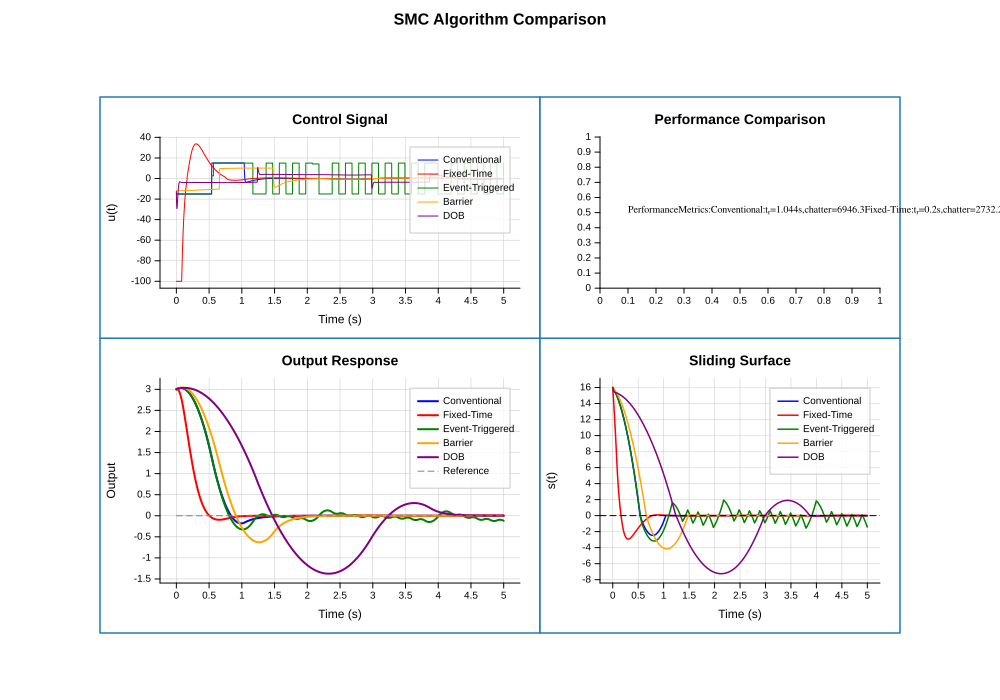
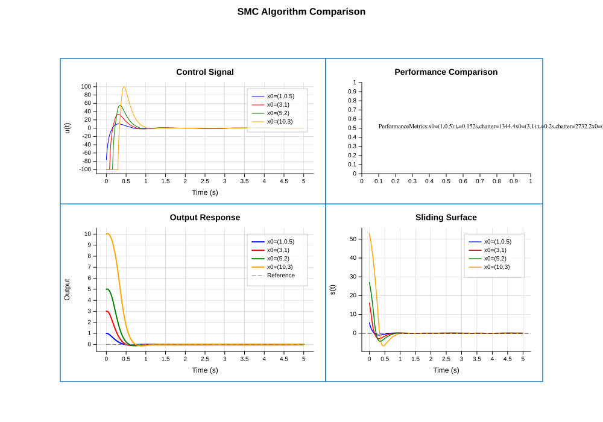
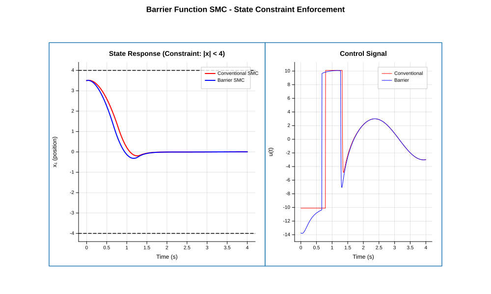
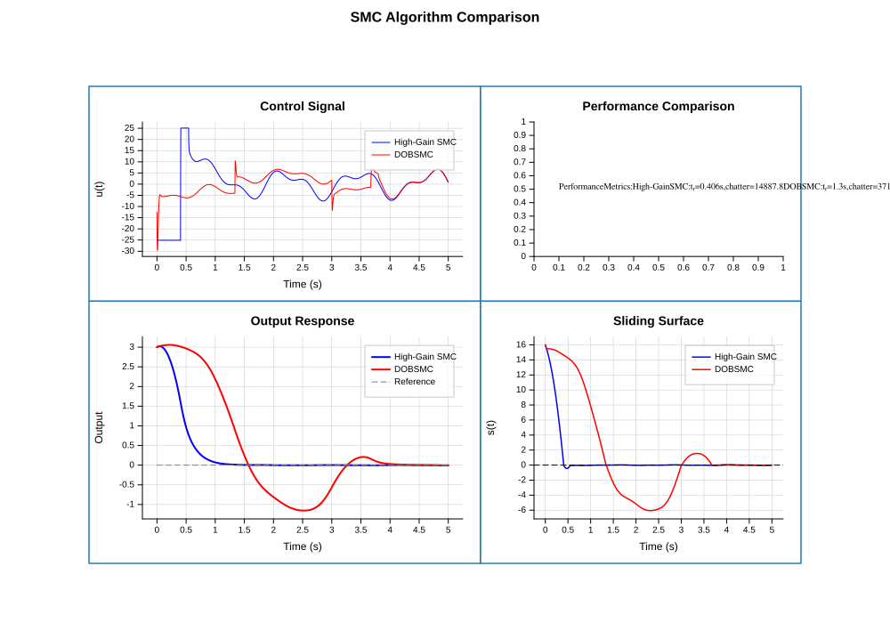
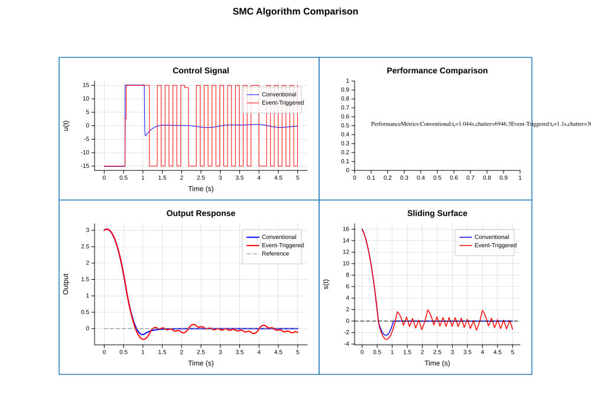

# CppPlot - A Matplotlib-style Plotting Library for C++

<p align="center">
  
</p>

## 🎯 Overview

**CppPlot** is a modern, header-only C++ plotting library inspired by Python's matplotlib. It provides a simple, intuitive API for creating publication-quality visualizations directly from C++ code.

## ✨ Features

- 📊 **Multiple Plot Types**: Line plots, scatter plots, bar charts, histograms
- 📈 **Scientific Features**: Error bars, fill between, log scale, annotations
- 🎛️ **Control Systems**: Bode, Nyquist, Nichols, Pole-Zero, Root Locus, Step/Impulse Response
- 🔧 **Controller Design**: PID, Lead/Lag, LQR, LQG, MPC, Pole Placement
- 📡 **State Estimation**: Kalman Filter, Extended KF, Unscented KF
- ⚡ **EE/Telecom Applications**: PLL, Power Converters, Motor Drives, Channel Equalization
- 🎨 **Rich Styling**: Colors, line styles, markers, legends, grids
- 🚀 **Advanced Nonlinear**: Sliding Mode Control (SMC), Barrier Functions, Event-Triggered Control
- 📐 **Subplots**: Create complex multi-plot figures with GridSpec
- ✍️ **LaTeX Support**: Mathematical expressions with LaTeX rendering
- 💾 **SVG Backend**: Clean, scalable vector graphics output
- 🔧 **Header-Only**: Easy integration, just include and use
- 🚀 **Modern C++14**: Clean, efficient, compatible with older compilers
- 🖥️ **Cross-Platform**: Windows, Linux, macOS

## 📚 Educational Companion

While CppPlot is a standalone library, it was originally developed alongside and acts as the official computational engine for the textbook:
**Modern Control Engineering with C++** (including the *Nonlinear and Adaptive Control* expansion).

The textbook project contains comprehensive tutorials, theoretical proofs, and Jupyter-style C++ Notebook (`cppnb`) environments to interactively learn control systems using this library.

## 📦 Installation

### Header-Only (Recommended)

Simply copy the `include/cppplot` folder to your project:

```bash
cp -r include/cppplot /your/project/include/
```

### CMake

```cmake
add_subdirectory(cppplot)
target_link_libraries(your_target PRIVATE cppplot)
```

### CMake FetchContent

```cmake
include(FetchContent)
FetchContent_Declare(
    cppplot
    GIT_REPOSITORY https://github.com/yourusername/cppplot.git
    GIT_TAG v1.0.0
)
FetchContent_MakeAvailable(cppplot)
target_link_libraries(your_target PRIVATE cppplot)
```

## 🚀 Quick Start

```cpp
#include <cppplot/cppplot.hpp>
using namespace cppplot;

int main() {
    // Create data
    std::vector<double> x = {1, 2, 3, 4, 5};
    std::vector<double> y = {1, 4, 9, 16, 25};
    
    // Plot with matplotlib-style API
    plot(x, y, "b-o");      // Blue line with circle markers
    xlabel("X Axis");
    ylabel("Y Axis");
    title("My First Plot");
    grid(true);
    savefig("my_plot.svg");
    
    return 0;
}
```

## 📖 Examples

### Line Plot

```cpp
std::vector<double> x = linspace(0, 2 * M_PI, 100);
std::vector<double> y_sin, y_cos;
for (auto xi : x) {
    y_sin.push_back(std::sin(xi));
    y_cos.push_back(std::cos(xi));
}

plot(x, y_sin, "r-", {{"label", "sin(x)"}});
plot(x, y_cos, "b--", {{"label", "cos(x)"}});
legend();
savefig("trig.svg");
```

### Scatter Plot

```cpp
auto [x, y] = random_data(100);
scatter(x, y, {
    {"c", "blue"},
    {"s", 50},
    {"alpha", 0.7}
});
savefig("scatter.svg");
```

### Error Bars (NEW)

```cpp
std::vector<double> x = {1, 2, 3, 4, 5};
std::vector<double> y = {2.1, 4.0, 5.9, 8.1, 10.0};
std::vector<double> yerr = {0.5, 0.4, 0.6, 0.5, 0.7};

// Plot with error bars
errorbar(x, y, yerr, opts({{"color", "blue"}, {"capsize", "5"}}));

// Add theoretical line
auto x_fit = linspace(0, 6, 50);
std::vector<double> y_fit;
for (double xi : x_fit) y_fit.push_back(2 * xi);
plot(x_fit, y_fit, "r--", opts({{"label", "Theory"}}));

title("Experimental Data with Error Bars");
legend(true);
savefig("errorbar.svg");
```

### Fill Between (NEW)

```cpp
auto x = linspace(0, 10, 100);
std::vector<double> y_mean, y_upper, y_lower;

for (double xi : x) {
    double val = std::sin(xi);
    y_mean.push_back(val);
    y_upper.push_back(val + 0.3);
    y_lower.push_back(val - 0.3);
}

// Fill confidence region
fill_between(x, y_lower, y_upper, opts({{"color", "blue"}, {"alpha", "0.3"}}));
plot(x, y_mean, "b-", opts({{"linewidth", "2"}}));

title("Signal with Confidence Interval");
savefig("fill_between.svg");
```

### Text Annotations (NEW)

```cpp
auto x = linspace(0, 2 * M_PI, 100);
std::vector<double> y;
for (double xi : x) y.push_back(std::sin(xi));

plot(x, y, "b-");

// Add text annotations
text(M_PI/2, 1.0, "Maximum", opts({{"ha", "center"}, {"fontsize", "12"}}));
text(3*M_PI/2, -1.0, "Minimum", opts({{"ha", "center"}}));

// Add reference lines
axhline(0, opts({{"color", "gray"}, {"linestyle", "--"}}));
axvline(M_PI, opts({{"color", "red"}, {"linestyle", ":"}}));

title("Sine Wave with Annotations");
savefig("annotations.svg");
```

### Log Scale (NEW)

```cpp
auto x = linspace(1, 100, 100);
std::vector<double> y;
for (double xi : x) y.push_back(std::pow(10, xi/25));

plot(x, y, "b-");
yscale("log");  // Set y-axis to logarithmic scale
// xscale("log");  // Can also set x-axis

title("Exponential Growth (Log Scale)");
grid(true);
savefig("log_scale.svg");
```

### Control System Plots (NEW)

CppPlot supports professional control system visualization following Python Control/MATLAB standards:

#### Bode Plot

```cpp
// Second-order system: G(s) = wn²/(s² + 2ζωₙs + ωₙ²)
double wn = 10.0, zeta = 0.3;
auto w = logspace(-1, 2, 200);  // 0.1 to 100 rad/s

std::vector<double> mag_dB, phase_deg;
for (double wi : w) {
    std::complex<double> s(0, wi);
    std::complex<double> H = (wn*wn) / (s*s + 2*zeta*wn*s + wn*wn);
    mag_dB.push_back(20 * std::log10(std::abs(H)));
    phase_deg.push_back(std::arg(H) * 180.0 / M_PI);
}

figure(800, 600);
subplot(2, 1, 1);
plot(w, mag_dB, "b-", opts({{"linewidth", "2"}}));
xscale("log");
ylabel("Magnitude (dB)");
grid(true);
title("Bode Plot - Second Order System");

subplot(2, 1, 2);
plot(w, phase_deg, "b-", opts({{"linewidth", "2"}}));
xscale("log");
xlabel("Frequency (rad/s)");
ylabel("Phase (deg)");
grid(true);
savefig("bode_plot.svg");
```

#### Nyquist Plot

```cpp
std::vector<double> re, im;
for (double wi : w) {
    std::complex<double> s(0, wi);
    std::complex<double> H = 1.0 / (s * (s + 1.0) * (s + 2.0));
    re.push_back(H.real());
    im.push_back(H.imag());
}

figure(700, 700);
plot(re, im, "b-", opts({{"linewidth", "2"}, {"label", "ω > 0"}}));
scatter({-1}, {0}, opts({{"s", "40"}, {"color", "red"}, {"marker", "+"}}));
text(-0.85, 0.1, "(-1, j0)", opts({{"color", "red"}}));
xlabel("Real");
ylabel("Imaginary");
title("Nyquist Plot");
grid(true);
legend(true);
savefig("nyquist.svg");
```

#### Pole-Zero Map

```cpp
// Poles: complex conjugate pair
double sigma = -zeta * wn;
double wd = wn * std::sqrt(1 - zeta*zeta);
std::vector<double> poles_re = {sigma, sigma};
std::vector<double> poles_im = {wd, -wd};
std::vector<double> zeros_re = {}, zeros_im = {};

figure(700, 700);
scatter(poles_re, poles_im, opts({{"s", "60"}, {"color", "red"}, {"marker", "x"}}));
scatter(zeros_re, zeros_im, opts({{"s", "60"}, {"color", "blue"}, {"marker", "o"}}));
axhline(0, opts({{"color", "black"}, {"linewidth", "0.5"}}));
axvline(0, opts({{"color", "black"}, {"linewidth", "0.5"}}));
xlabel("Real Axis");
ylabel("Imaginary Axis");
title("Pole-Zero Map");
grid(true);
savefig("pzmap.svg");
```

#### Step Response

```cpp
auto t = linspace(0, 2, 500);
std::vector<double> y;

for (double ti : t) {
    double y_val = 1.0 - std::exp(-zeta*wn*ti) * 
        (std::cos(wd*ti) + (zeta*wn/wd)*std::sin(wd*ti));
    y.push_back(y_val);
}

figure(800, 500);
plot(t, y, "b-", opts({{"linewidth", "2"}}));
axhline(1.0, opts({{"color", "gray"}, {"linestyle", "--"}}));
xlabel("Time (s)");
ylabel("Response");
title("Step Response");
grid(true);
savefig("step_response.svg");
```

### Advanced Nonlinear Control (NEW)

CppPlot provides robust visualization for advanced PhD-level control algorithms, including multiple variants of Sliding Mode Control (SMC).

<div align="center">
  
  <br><em>Comparison of standard SMC vs. Super-Twisting vs. Integral SMC</em>
</div>

#### Fixed-Time Stabilization

<div align="center">
  
  <br><em>Convergence guaranteed within a fixed time regardless of initial conditions</em>
</div>

#### Control Barrier Functions (Safety)

<div align="center">
  
  <br><em>State trajectory constrained safely within a predefined barrier</em>
</div>

#### Disturbance Observer Based SMC

<div align="center">
  
  <br><em>Disturbance attenuation comparison with robust DOB tracking</em>
</div>

#### Event-Triggered Communication

<div align="center">
  
  <br><em>Reducing communication overhead via event-triggered control updates</em>
</div>

### Bar Chart

```cpp
std::vector<std::string> categories = {"A", "B", "C", "D"};
std::vector<double> values = {23, 45, 56, 78};

bar(categories, values, {{"color", "steelblue"}});
title("Sales by Category");
savefig("bar.svg");
```

### Subplots

```cpp
auto fig = figure(1200, 400);

auto& ax1 = fig.subplot(1, 3, 1);
ax1.plot(x, y1).title("Plot 1");

auto& ax2 = fig.subplot(1, 3, 2);
ax2.scatter(x, y2).title("Plot 2");

auto& ax3 = fig.subplot(1, 3, 3);
ax3.bar(cats, vals).title("Plot 3");


fig.savefig("subplots.svg");
```

### Flexible Layouts (Julia Plots-style)

CppPlot supports flexible layouts similar to Julia's Plots package:

#### Spanning Multiple Cells

```cpp
figure(900, 600);

// Span cells 1 and 2 in the top row
subplot(2, 2, {1, 2});
plot(x, y);
title("Wide plot spanning 2 columns");

// Normal subplots
subplot(2, 2, 3);
hist(data1);

subplot(2, 2, 4);
bar(x, y);

savefig("span_layout.svg");
```

#### Custom Column/Row Sizes

```cpp
figure(800, 600);

// Set layout with custom widths (1:2:1 ratio)
layout(2, 3, {1, 2, 1});

subplot(2, 3, 1);  // Small
subplot(2, 3, 2);  // Wide (2x)
subplot(2, 3, 3);  // Small
// ...
```

#### GridSpec for Full Control

```cpp
figure(1000, 800);

// Create grid with custom sizes
GridSpec gs(3, 3);
gs.setWidthRatios({1, 2, 1});
gs.setHeightRatios({1, 2, 1});
gs.setSpacing(0.1, 0.15);
gs.setMargins(0.1, 0.95, 0.1, 0.92);
gcf().setLayout(gs);

// Use subplot_span for precise positioning (0-based)
subplot_span(0, 0, 1, 1);  // Span rows 0-1, cols 0-1
plot(x, y);

subplot_span(0, 2, 0, 2);  // Single cell at (0,2)
hist(data);
```

#### Inset Axes

```cpp
figure(800, 600);

// Main plot
subplot(1, 1, 1);
plot(x, y);

// Add inset axes (x, y, width, height) in normalized coords
inset_axes(0.6, 0.6, 0.35, 0.3);
plot(x_zoom, y_zoom);
title("Zoomed view");

savefig("inset.svg");
```

#### Free-form Layout with add_axes

```cpp
figure(1000, 700);

// Place axes anywhere (left, bottom, width, height)
add_axes(0.1, 0.3, 0.55, 0.6);  // Main plot
plot(x, y);

add_axes(0.7, 0.3, 0.25, 0.6);  // Side panel
hist(data);

add_axes(0.1, 0.08, 0.85, 0.15);  // Bottom strip
plot(x2, y2);

savefig("freeform.svg");
```

## 🎨 Format Strings

Like matplotlib, CppPlot supports format strings:

| Character | Color |
|-----------|-------|
| `b` | Blue |
| `g` | Green |
| `r` | Red |
| `c` | Cyan |
| `m` | Magenta |
| `y` | Yellow |
| `k` | Black |
| `w` | White |

| Character | Line Style |
|-----------|------------|
| `-` | Solid line |
| `--` | Dashed line |
| `-.` | Dash-dot line |
| `:` | Dotted line |

| Character | Marker |
|-----------|--------|
| `o` | Circle |
| `s` | Square |
| `^` | Triangle up |
| `v` | Triangle down |
| `x` | X mark |
| `+` | Plus |
| `*` | Star |

## 🔧 Configuration

```cpp
// Set default figure size
cppplot::config::default_figsize = {800, 600};

// Set default DPI
cppplot::config::default_dpi = 100;

// Set default style
cppplot::config::default_style = "seaborn";
```

## 📚 API Reference

See the [API Documentation](docs/api.md) for complete reference.

### Control System Functions

| Function | Description |
|----------|-------------|
| `xscale("log")` | Set x-axis to logarithmic scale (for Bode plots) |
| `yscale("log")` | Set y-axis to logarithmic scale |
| `axhline(y, opts)` | Draw horizontal line at y |
| `axvline(x, opts)` | Draw vertical line at x |
| `scatter(x, y, opts)` | Plot markers (poles: `"x"`, zeros: `"o"`) |
| `text(x, y, str, opts)` | Add text annotation |
| `fill_between(x, y1, y2)` | Fill region (for stability margins) |

### Marker Options for Control Plots

```cpp
// Poles (×) - typically red
scatter(poles_re, poles_im, opts({{"s", "60"}, {"color", "red"}, {"marker", "x"}}));

// Zeros (○) - typically blue  
scatter(zeros_re, zeros_im, opts({{"s", "60"}, {"color", "blue"}, {"marker", "o"}}));

// Critical point (+)
scatter({-1}, {0}, opts({{"s", "40"}, {"color", "red"}, {"marker", "+"}}));
```

## 🏗️ Building from Source

```bash
mkdir build && cd build
cmake ..
cmake --build .
```

### Run Examples

```bash
./examples/basic_plot
./examples/subplots
./examples/styles
```

### Run Tests

```bash
ctest --output-on-failure
```

## 📋 Requirements

- C++14 compatible compiler (C++17 optional)
- CMake 3.14+ (for building)

### Tested Compilers

- GCC 6.3+ 
- Clang 5+
- MSVC 2017+

## 🤝 Contributing

Contributions are welcome! Please read our [Contributing Guide](CONTRIBUTING.md) first.

## 📄 License

MIT License - see [LICENSE](LICENSE) file.

## 🙏 Acknowledgments

- Inspired by [matplotlib](https://matplotlib.org/)
- Control system plotting follows [Python Control](https://python-control.readthedocs.io/) standards
- SVG generation techniques from various open-source projects
- The C++ community for feedback and suggestions

---
**Note on Development**: The core implementations of these libraries were significantly assisted/generated by Large Language Models (LLMs)/Agentic AI, guided and architected by the repository owner.

<p align="center">
  Made with ❤️ for the C++ community
</p>
